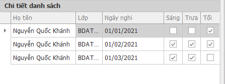

# Note for Hệ thống thông tin thầy Jang

## A. Phần form + menubar list chức năng

- cần thêm form của Lớp : do tài khoản lớp trưởng đăng nhập 

## I. Giao diện Lớp 

có các chức năng : 

|    tên chức năng     | Mô tả                                                        |
| :------------------: | ------------------------------------------------------------ |
|    Nhập danh sách    | Nhập danh sách đăng ký + gửi duyệt                           |
|    Đang chờ duyệt    | DS đang đợi duyệt ()                                         |
|       Đã duyệt       | DS đã được duyệt (tên cán bộ c,d duyệt)                      |
|        Đã hủy        | DS bị hủy (tên cán bộ c,d duyệt)                             |
| Thông tin thanh toán | Hiện các đợt thanh toán, danh sách thanh toán, tính năng tạo pdf in ds |

> Cần khăc phục ở danh sách : Mỗi học viên chỉ trên một dòng, thông tin chi tiết xem ở form khác.
>
> 

## II. Phần giao diện Đại Đội

- thêm chức năng ở menubar : **Danh sách chờ duyệt** (để duyệt ds lớp gửi lên) (xây dựng giống chức năng ở tiểu đoàn)

  

  

ở danh sách thêm button để hủy theo từng học viên (học viên bị loại khỏi ds + thêm vào ds hủy + (có thể có nút undo))

- Phần **đăng ký cắt cơm**

phần Đăng ký cắt cơm: **chọn** và **thêm** loại nghỉ (thêm vào **chi tiết loại nghỉ**)

Bổ sung csdl : chi tiết ra ngoài thêm **ngày nghỉ + ngày trả phép** 

Phần danh sách sửa : Họ tên, lớp, Tên loại nghỉ, Chi tiết nghỉ (ấn vào hiện ra from mới), Xóa

Làm thêm chi tiết nghỉ : popup gồm : mã đăng ký, tên học viên,  ngày nghỉ, ngày trả phép.

- ra ngoài thêm  tickbox **cả ngày**

  ## III. Giao diện tiểu đoàn
  
  - Thêm chức năng ở menubar: Thống kê số học viên cắt cơm và tiền cắt cơm
  - Cần thêm tiêu chuẩn tiền ăn của từng loại học viên, sửa ngày áp dụng và cập nhật tiền ăn mới, thêm chi tiết loại nghỉ có số bữa cố định như tranh thủ, nghỉ phép,...
